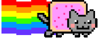

# The RGBs Game 🌈

The RGBs Game is a fun, enjoyable & endless PWA game that tests your skills on mastery of colors.

## How play the game

- Select 'Easy', 'Medium' or 'Hard' mode
- This will generate new random colors for the difficulty you choose
- The correct rgb color code is shown on the top-left of the page
- Click on the correct circle that matches the correct rgb color code
- When you win or lose, click the 'New colors' button to generate new colors for your difficulty level
- Have FUN 🎉

  

## Built using

- HTML
- CSS
- Vanilla Javascript
- Progressier

## Authors

- **Victor Allen** - [vamuigua](https://github.com/vamuigua) :v:

## License

This project is licensed under the MIT License - see the [LICENSE](LICENSE) file for details

## Acknowledgments

- **Progressier, for seamless PWA service setup** - [Visit site](https://progressier.com/)
