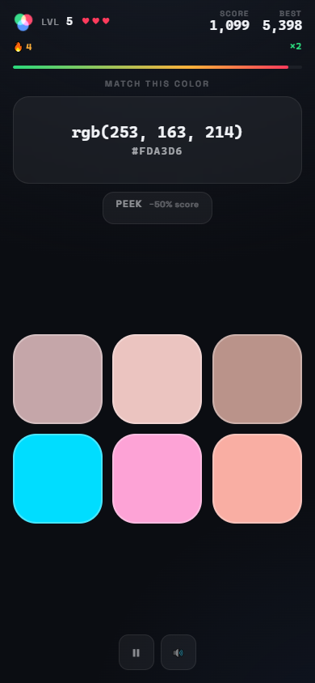
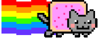

# The RGBs Game 🌈

[](https://app.netlify.com/sites/rgbs/deploys)

Read an RGB value, spot the color. A fast, endless, installable PWA that tests
how well you actually know color.



## How to play

You are shown an RGB value — **the color itself stays hidden**. Find the tile
that *is* that color.

- Pick a **mode** and a **difficulty**, then hit PLAY.
- Tap the tile you think matches. Correct answers build a streak and a score
  multiplier.
- Stuck? **PEEK** flashes the real color for half a second, at the cost of half
  that round's points.

Never done this before? The game opens with a short interactive tutorial that
teaches RGB by playing it — meet each channel, mix them, then work the 0–255
scale. Replay it any time from **Settings**.

## Modes

| Mode | Lives | Timer | On a wrong guess |
| --- | --- | --- | --- |
| **ARCADE** | 3 | Yes — tightens as you level up | Lose a life, streak resets |
| **STEADY** | 3 | No | Lose a life, streak resets |
| **ZEN** | ∞ | No | Nothing but points — keep guessing |

## Difficulty

**EASY** (3 tiles) · **MEDIUM** (6 tiles) · **HARD** (9 tiles) — but the tile
count is the least of it. Colors are generated in CIELAB and judged on how
different they actually *look*, so HARD separates tiles by hue rather than
brightness.

**The game adapts to you.** Every clean win narrows the gap between colors;
every wrong guess widens it again. Difficulty settles wherever your eye actually
is, and a hard floor guarantees every round stays solvable.

Best scores are kept per mode *and* difficulty, so HARD ARCADE never competes
with EASY ZEN.

## Accessibility

- Every tile is a real `<button>` labelled with its RGB and hex value, so the
  game can be played by **reading** rather than by seeing color.
- Full keyboard play: <kbd>1</kbd>–<kbd>9</kbd> pick a tile · arrows move ·
  <kbd>Enter</kbd> select · <kbd>P</kbd> peek · <kbd>N</kbd> new colors ·
  <kbd>M</kbd> mute · <kbd>Esc</kbd> pause.
- Correct/incorrect never rely on color alone — there is a glyph, text and an
  ARIA live announcement.
- All animation respects `prefers-reduced-motion`.

## Run it locally

**No framework, no bundler, no dependencies, no build step.** The whole game is
hand-written HTML, CSS and ES modules, served as static files. You need
[Node.js](https://nodejs.org) 18+ only to run the local server — there is
nothing to install.

```bash
git clone https://github.com/vamuigua/RGBs-Color-Game.git
cd RGBs-Color-Game
node dev-server.mjs
```

Then open <http://localhost:8080>.

> **The game cannot be opened from `file://`.** It uses ES modules and a service
> worker, both of which need an `http(s)` origin. Any static server works —
> `python3 -m http.server`, `npx serve` — the bundled one just avoids needing
> anything installed.

## Documentation

**[docs/TECHNICAL.md](docs/TECHNICAL.md)** covers the rest: the perceptual color
engine, the hidden Game Tuning Lab, the test harness, browser storage, the
Netlify setup, and the constraints to know before changing code.

<p align="center">
  
</p>

## Authors

- **Victor Allen** - [vamuigua](https://github.com/vamuigua) :v:

## License

This project is licensed under the MIT License - see the [LICENSE](LICENSE) file for details
